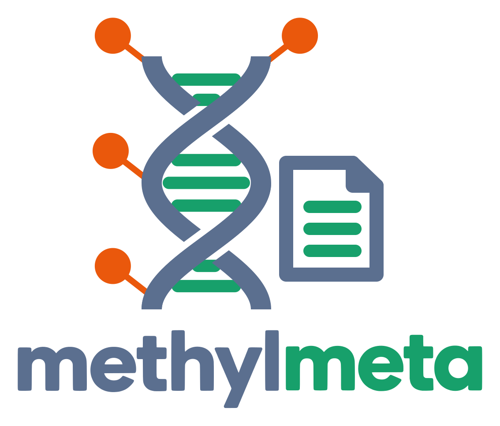

<p align="center">
  
</p>

# methylmeta

Curated metadata, class definitions, and sample annotations for DNA
methylation-based tumor classification datasets.

Public Illumina methylation array datasets (GEO, ArrayExpress, TCGA, TARGET,
...) describe their samples in wildly different ways: free-text diagnoses,
author-specific abbreviations, inconsistent column names. `methylmeta` turns
them into **one harmonized sample table** with a controlled vocabulary of
tumor types.

It consists of four parts:

| Part | Where | What |
| --- | --- | --- |
| Tumor vocabulary | `src/methylmeta/data/tumor_types.yaml` | ~1,700 methylation classes (WHO-style acronyms) with name, WHO volume, site, lineage, families and parent |
| Dataset configs | `configs/datasets/<dataset_id>.py` | One small Python file per dataset (623 so far) that maps the raw sample sheet to the canonical schema |
| Harmonizer / merger | `src/methylmeta/` | Loads configs, validates every row, merges datasets into one table |
| Config-writing agent | `methylmeta agent` | An LLM agent that drafts and tests a config for a new dataset |

## Installation

Requires Python >= 3.12. The project uses [uv](https://docs.astral.sh/uv/):

```bash
git clone https://github.com/brj0/methylmeta.git
cd methylmeta
uv sync --extra dev     # or: pip install -e ".[dev]"
```

Dataset configs live in the repository (not in the installed package), so
install in editable mode / run from a checkout.

## Quick start

```bash
# 1. Which datasets contain the tumor types I care about?
methylmeta find --classes SCHW,MPNST

# 2. Download metadata for them (IDATs only on request, they are large)
methylmeta find --classes SCHW,MPNST --format ids > ids.txt
methylmeta fetch $(cat ids.txt) --dataset_dir ~/data --idat

# 3. Harmonize and merge into one TSV
methylmeta merge --dataset_dir ~/data --datasets $(paste -sd, ids.txt) \
    --output merged.tsv
```

Or from Python:

```python
from methylmeta import MetadataMerger
from methylmeta.paths import CONFIGS_DIR

merger = MetadataMerger(config_dir=CONFIGS_DIR, dataset_dir="~/data")
df = merger.merge(dataset_ids=["GSE90496", "GSE109381"])   # polars.DataFrame
df = merger.add_array_types(df)   # optional: reads array type from IDAT headers
```

### Expected directory layout

`--dataset_dir` contains one folder per dataset, holding its sample sheet
(exactly one `.csv`/`.tsv`/`.xlsx`/`.xls`) and, optionally, its IDATs:

```
~/data/
  GSE90496/
    GSE90496_sample_sheet.csv
    201904410008_R06C01_Grn.idat
    201904410008_R06C01_Red.idat
  E-MTAB-7478/
    ...
```

`methylmeta fetch` creates exactly this layout.

If a dataset's GEO/ArrayExpress sheet is useless but the authors published
the real annotation as a paper supplement, drop it into `data/metadata/` as
`<dataset_id>.<ext>` (see `GSE140686.tsv`). It then replaces the sheet in the
dataset folder (`--metadata_dir` changes that location).

## The harmonized table

Every row is validated against the `SampleMetadata` schema
(`src/methylmeta/schema.py`):

| Column | Meaning |
| --- | --- |
| `dataset_id` | GEO / ArrayExpress / TCGA accession or cohort name |
| `description` | One-line description of the cohort (first author, year) |
| `sample_id` | Basename of the IDAT pair (without `_Grn.idat` / `_Red.idat`) |
| `diagnosis` | Full-text diagnosis of the *sampled tissue* |
| `methylation_class` | Acronym from `tumor_types.yaml` (enforced) |
| `sample_site` / `primary_site` | Where the material came from / where the tumor originated |
| `sample_type` | `control`, `primary`, `metastasis`, `recurrence` |
| `material_type` | `tissue`, `cell_line`, `blood`, `csf` |
| `preservation` | `FFPE`, `FROZEN`, `FRESH` |
| `tumor_grade` | `G1`-`G4`, low/high-grade, Gleason, ISUP |
| `sex`, `age` | Patient sex and age in years |
| `array_type` | Added by `add_array_types` / `merge` from the IDAT header |

`methylation_class` must be a key in `tumor_types.yaml`, so typos and
legacy acronyms fail loudly. `(dataset_id, sample_id)` must be unique across
the merge.

## Dataset configs

A config is a plain Python file named after the dataset, with one function
per canonical field. It receives one raw row (`dict`) and returns the value:

```python
# configs/datasets/GSE12345.py
def dataset_id(row):
    return "GSE12345"

def description(row):
    return "Methylation profiling of schwannomas, Doe 2020"

def sample_id(row):
    return row["Sample_ID"]

def diagnosis(row):
    return row["histology"]

def methylation_class(row):
    mapping = {
        "schwannoma": "SCHW",
        "MPNST": "MPNST",
    }
    return mapping[row["histology"]]   # unmapped values raise -> no silent errors
```

Conventions: use `row["col"]` and plain `dict[...]` lookups so surprises fail
loudly, no regex, no row filtering, helper functions start with `_`. Any
other public function is reported as an error, because it would be ignored.
The full contract is available as `methylmeta.CONFIG_SPEC`.

### Workflow for a new dataset

```bash
methylmeta fetch GSE12345 --dataset_dir ~/data --idat
methylmeta profile GSE12345 --dataset_dir ~/data    # columns + value distributions
methylmeta search_vocab "vestibular schwannoma"     # find the right acronym
# write configs/datasets/GSE12345.py
methylmeta test GSE12345 --dataset_dir ~/data       # dry run, every failing row reported
```

`methylmeta test` reports all failing rows grouped by error, the fill rate of
every field, and a `diagnosis -> methylation_class` table to review by eye.

### Let an agent write the config

```bash
methylmeta agent GSE12345 --dataset_dir ~/data --log_dir ~/logs
```

The agent (built on [pydantic-ai](https://ai.pydantic.dev), default model
`deepseek:deepseek-v4-flash`, change with `--model`) profiles the sheet, reads
the study description, looks at similar existing configs, searches the
vocabulary, writes the file, and iterates on `test` until it passes. You need
the API key for your model provider in the environment (as pydantic-ai
expects it). Existing configs are only replaced with `--force`, and a backup
is kept. Always review the generated mapping table.

`scripts/harmonize_pipeline.py` runs fetch -> agent -> test -> merge over a
list of datasets, collecting failures instead of aborting.

## Finding the datasets for a project

`methylmeta find` tells you which datasets contain given tumor types, so you
know what to download *before* fetching anything. It reads the dataset
configs (`configs/datasets/`) statically, so no raw data is needed.

```bash
# By acronym (sub-entities are included, e.g. SKIN_MEL also selects ACR_MEL)
methylmeta find --classes SKIN_MEL,SCHW

# By family tag or anatomical site; selectors are OR-ed
methylmeta find --family glioma --site kidney

# Which of them are not downloaded yet? Then fetch exactly those.
methylmeta find --classes SCHW --dataset_dir ~/data --missing --format ids > ids.txt
methylmeta fetch $(cat ids.txt) --dataset_dir ~/data
```

Use `methylmeta search_vocab <text>` to look up acronyms.

For your own analysis, `--format tsv` writes one row per dataset/class pair
(columns: dataset_id, methylation_class, name, site, lineage_broad, families
`|`-joined, parent). It respects the selectors, so with none it is the whole
catalog:

```bash
methylmeta find --format tsv > catalog.tsv
```

```python
import polars as pl

df = pl.read_csv("catalog.tsv", separator="\t")
(
    df.filter(pl.col("methylation_class").is_in(["SCHW", "MPNST"]))
    .group_by("dataset_id")
    .agg(pl.col("methylation_class").unique())
)
```

`--format json` gives the same information as nested records.

Limits: a dataset matches if its config *can* produce a class (no case
counts), so a dataset with a single rare case matches too. Classes that are not
spelled out as a literal in the config (e.g. a bare `return row["class"]`) are
not seen.

## CLI reference

| Command | Purpose |
| --- | --- |
| `find` | Which datasets contain given tumor types (no data needed) |
| `fetch` | Download missing metadata (and with `--idat`, IDATs) |
| `profile` | Summarize raw columns of a dataset before writing a config |
| `test` | Dry-run a config against real metadata |
| `agent` | Create or repair a config with an LLM agent |
| `merge` | Harmonize and merge datasets into one TSV (`--list_missing` shows datasets lacking a config) |
| `search_vocab` | Free-text search in the tumor vocabulary |

Run `methylmeta <command> --help` for all options.

## Maintaining the vocabulary

`tumor_types.yaml` follows the rules in
[`naming_convention.md`](src/methylmeta/data/naming_convention.md); allowed
sites, lineages and volumes are in `vocabulary.yaml`.

```bash
python scripts/normalize_tumor_types.py --check   # validate against vocabulary.yaml
python scripts/sort_tumor_types.py                # keep entries sorted
```

## Development

```bash
pytest                    # every config must load and follow the contract
ruff check . && ruff format --check .
mypy src
```

## License

Apache-2.0, see [LICENSE](LICENSE).
